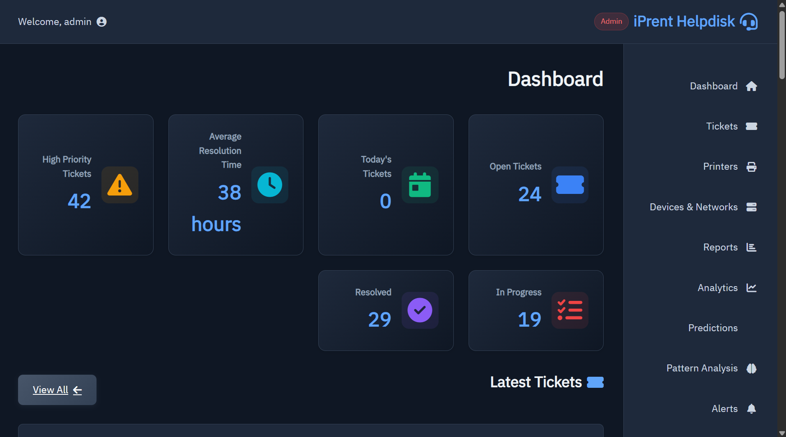
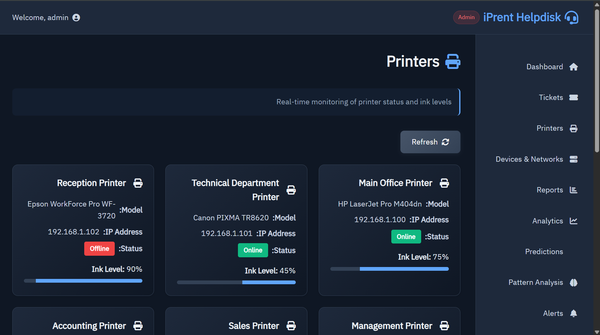

# iPrent Helpdesk Platform

**AI-powered support desk platform for IT operations, ticket management, and device monitoring.**

[Visit this repository on GitHub](https://github.com/Bassammeshal511/iPrent-Helpdesk-Platform)

---

## Why this repository stands out

This project is built as a polished showcase for technical leadership and executive review. It combines:

- **Smart ticket intelligence** with AI classification and priority scoring
- **Live equipment monitoring** for printers, servers, and network devices
- **Executive dashboard** that presents key metrics at a glance
- **Operational alerts** for critical issues like offline hardware and low ink
- **Modern Arabic-first interface** with strong visual presentation

---

## Preview

### Dashboard view


### Ticket management



### Printer operations



---

## Features

- AI-assisted ticket classification and initial response generation
- Ticket lifecycle tracking: Open, In Progress, Resolved
- Priority scoring and operational alerts
- Printer ink-level monitoring and offline detection
- Device inventory for servers, network gear, and workstations
- Analytics-ready dashboard with executive metrics and charts

---

## Repository layout

```
├─ app.py                    # Flask application and main business logic
├─ config.py                 # Environment and database settings
├─ ai_model.py               # AI ticket classification and response logic
├─ migrate_db.py             # Database migration helper
├─ requirements.txt          # Python dependencies
├─ LICENSE                  # MIT open-source license
├─ README.md                # Project overview and setup guide
├─ docs/screenshots/        # Selected preview images for GitHub
└─ templates/               # HTML templates for the UI
```

---

## Installation

```powershell
python -m venv .venv
.\.venv\Scripts\Activate.ps1
pip install -r requirements.txt
python app.py
```

Then open `http://127.0.0.1:5000/` in your browser.

---

## Notes

- The repository is configured to ignore local environment files and generated database files.
- Large model artifacts such as `models/ticket_ai_model.h5` remain excluded from source control.
- The project is ready to present as a strong GitHub portfolio item.
