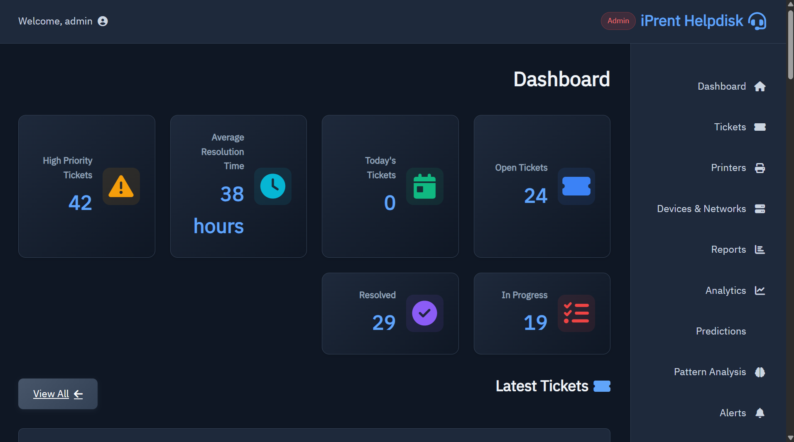
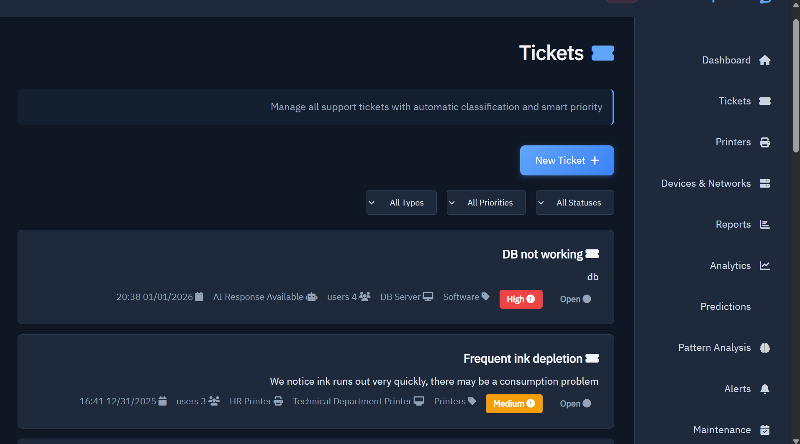
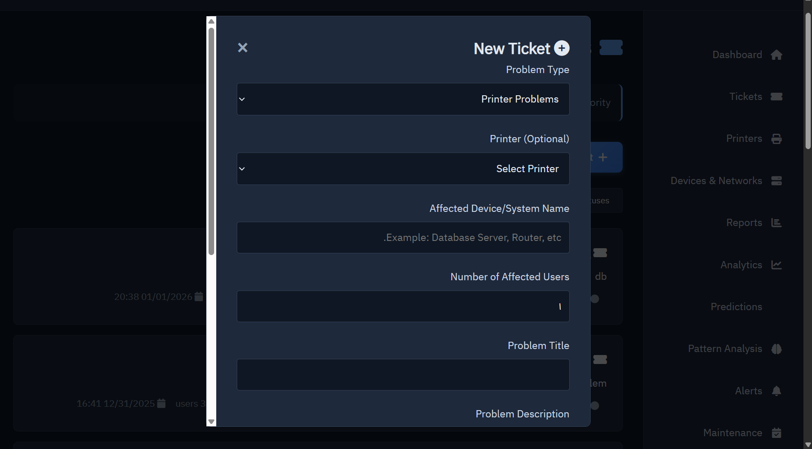

# <div align="center">
<h1>iPrent Helpdesk Platform 🛠️</h1>

<p><strong>Enterprise-ready IT support desk with AI-powered ticket triage, printer and device monitoring, and executive reporting.</strong></p>

<p><a href="https://github.com/Bassammeshal511/iPrent-Helpdesk-Platform">View this repository on GitHub</a></p>
</div>

---

## Executive summary 🎯

`iPrent Helpdesk Platform` is designed for IT operations teams that require a modern helpdesk environment with built-in intelligence and real-time infrastructure awareness. It combines:

- 🔍 AI-driven ticket classification and response guidance
- 📤 Priority-based ticket routing for faster SLA compliance
- 📡 Printer and device health monitoring with automated alerts
- 📊 Executive dashboard visuals for rapid decision-making
- 🌐 Arabic-first user experience for regional deployment

---

## Workflow overview ⚙️

1. 🔐 User login and ticket submission
2. 🤖 AI classification of issue type, category, and priority
3. 🔀 Automated ticket routing to the appropriate support queue
4. 🔄 Real-time status updates for open, in-progress, and resolved tickets
5. 📡 Continuous printer and device monitoring with proactive alerts
6. 📈 Executive dashboard analytics for operational performance

This workflow supports both helpdesk agents and IT managers with visibility, speed, and data-driven prioritization.

---

## Preview

### Dashboard overview 🖥️



### Ticket management and lifecycle 🎟️



#### Ticket details / New ticket modal



### Printer and device operations 🖨️


---

## Key capabilities ✨

- 🤖 AI-assisted ticket classification and suggested response generation
- 🗂️ Ticket lifecycle tracking: Open, In Progress, Resolved
- 🚨 Dynamic priority scoring and critical incident alerts
- 🖨️ Printer ink-level monitoring, offline detection, and status warnings
- 🖥️ Support for printers, network infrastructure, hardware, and software incidents
- 📊 Executive dashboard with metrics, charts, and actionable insights

---

## Project structure

```
├─ app.py                    # Flask application and main business logic
├─ config.py                 # Environment and database settings
├─ ai_model.py               # AI ticket classification and response model
├─ migrate_db.py             # Database migration helper
├─ requirements.txt          # Python dependencies
├─ LICENSE                  # MIT open-source license
├─ README.md                # Project overview and setup guide
├─ docs/screenshots/        # Selected preview images for GitHub
├─ models/                   # Machine learning artifacts and model metadata
├─ static/                   # CSS, JavaScript, and frontend assets
└─ templates/                # Flask HTML templates for the UI
```

---

## Quick start

```powershell
python -m venv .venv
.\.venv\Scripts\Activate.ps1
pip install -r requirements.txt
python app.py
```

Open `http://127.0.0.1:5000/` to access the platform.

---

## Notes

- Local environment files and generated database files are excluded from source control.
- Large model artifacts such as `models/ticket_ai_model.h5` remain outside the repository.
- This repo is structured as a professional portfolio showcase for IT operations and support automation.
